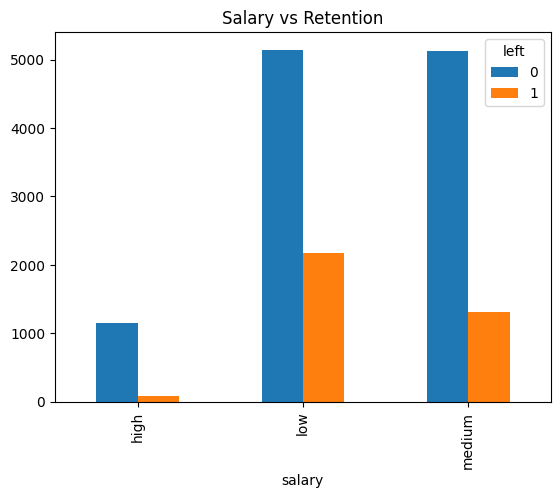
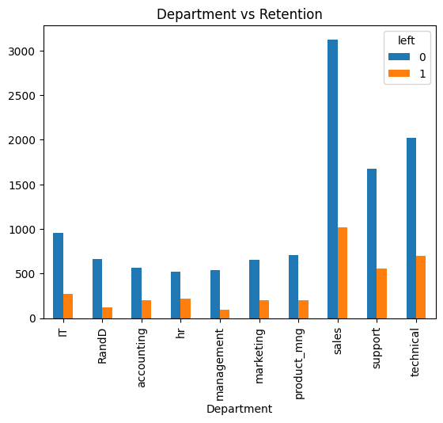

# 📊 Employee Retention Prediction System

An end-to-end Machine Learning project that predicts employee churn using **Logistic Regression**. This project analyzes key workforce factors—such as satisfaction level, average monthly hours, salary tier, and recent promotions—to identify employees at risk of leaving the company.

---

## 📌 Project Overview
Employee turnover can be costly for organizations. By identifying the underlying factors behind employee departures, HR teams can take proactive retention measures. 

In this project, we:
- Performed **Exploratory Data Analysis (EDA)** to observe underlying retention patterns.
- Preprocessed numerical features and applied **One-Hot Encoding** (`drop_first=True`) for categorical columns like `salary`.
- Trained a **Logistic Regression** model achieving **~78% Accuracy**.

---

## 📊 Exploratory Data Analysis & Visualizations

Here is a summary of key insights extracted from the dataset:

## 📊 Exploratory Data Analysis & Visualizations

Here is a summary of key insights extracted from the dataset:

### 1. Impact of Salary on Employee Retention
Employees in the **low salary** band show significantly lower retention rates compared to those with high salaries.



### 2. Department-wise Retention
Retention rates vary across departments, with Sales, Technical, and Support teams facing lower retention overall.



## 🛠️ Machine Learning Workflow

### 1. Feature Selection & Encoding
We selected key attributes based on correlation with retention:
- `satisfaction_level`
- `average_montly_hours`
- `promotion_last_5years`
- `salary` (Dummy Encoded)

### 2. Model Training & Evaluation
```python
# Train-Test Split (80/20)
X_train, X_test, y_train, y_test = train_test_split(X, y, test_size=0.2, random_state=1)

# Fit Logistic Regression
model = LogisticRegression(max_iter=1000)
model.fit(X_train, y_train)

# Accuracy Evaluation
accuracy = model.score(X_test, y_test)
print(f"Model Accuracy: {accuracy * 100:.2f}%")
